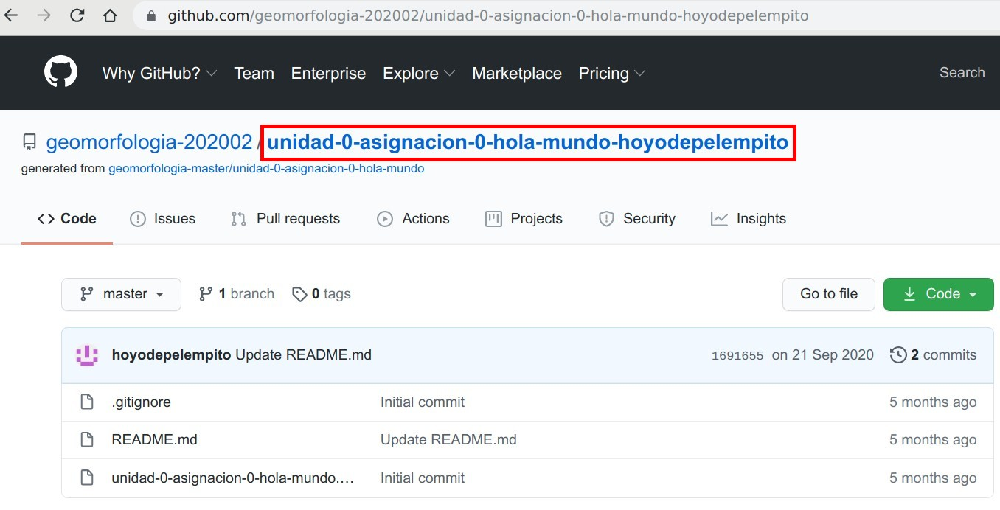

# Hola Mundo

> "Sin embargo, el mundo nunca responde"

**Por José Ramón Martínez Batlle**

Probemos que GitHub funciona.

Si estás leyendo este texto, es muy probable que hayas aceptado una invitación para clonar este repo, y te encuentras en una instancia del mismo con el nombre `unidad-0-asignacion0-hola-mundo-tuusuariodegithub`; mira este ejemplo de la edición 2020-02 de la asignatura, perteneciente al usuario `hoyodepelempito`:

{width=50%}

Si no has aceptado la invitación aún, ve a tu correo (revisa tu spam), localiza un mensaje con el asunto `unidad-0-asignacion-0-hola-mundo` y acepta la invitación. También puedes encontrar esta asignación en el canal `Asignaciones` del foro de la asignatura. Al hacer clic sobre la invitación, se generará tu instancia del repo. Si no recibiste la invitación, avísame por el foro o escribe a mi correo.

Realiza tu asignación en los siguientes pasos:

1. En tu repo, desde GitHub, haz clic sobre el nombre de archivo `README.md`, que es precisamente el que contiene este texto.

2. Haz clic en el lápiz de edición de la parte superior del archivo para entrar al modo edición.

3. En modo edición, escribe tus nombres y apellidos, sustituyendo los puntos suspensivos que verás a continuación por tu respuesta:

  * Tu respuesta aquí: ...
  
4. Al finalizar, ve al fondo y presiona `Commit changes`.
